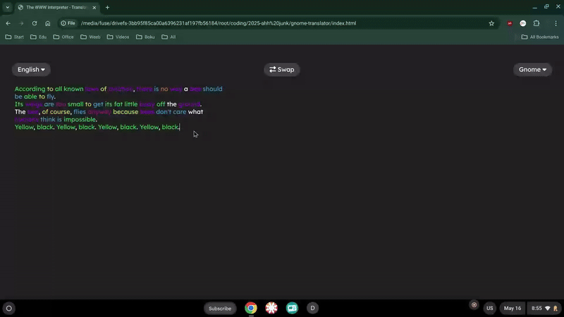

# aboutconfig-browser
aboutconfig-browser is a port of Mozilla Firefox's `about:config` that can be used to control your own advanced preferences.


<br/><i>Demo of aboutconfig-browser running on a local testing version of WWW Interpreter.</i>

## How to set up
First you'll need to set up a `firefox-internal-env.js` file. It needs to contain a `Services` object. Here's a quick sample of how you might set this up.
```js
window.Services = {
    prefs: {
        getBoolPref: (prefId) => prefId === 'user.changed.preference' || prefId === 'browser.aboutConfig.showWarning',
        getStringPref: (prefId) => prefId === 'user.added.preference' ? "im the user lol" : "testing",
        getIntPref: (prefId) => 5,
        getDefaultBranch: () => {
            // default preferences
            return {
                getBoolPref: (prefId) => prefId === 'browser.aboutConfig.showWarning',
                getStringPref: (prefId) => false,
                getIntPref: (pref) => 5,
                getPrefType: (prefId) => {
                    return {
                        'user.changed.preference': 'boolean',
                        'system.set.preference': 'boolean',
                        'browser.secrets.text': 'string',
                        'browser.secrets.number': 'string',
                        'browser.aboutConfig.showWarning': 'boolean'
                    }[prefId];
                },
                getChildList: () => ['user.changed.preference','system.set.preference','browser.secrets.text','browser.secrets.number','browser.aboutConfig.showWarning']
            };
        },
        setBoolPref: (prefId, value) => void(0),
        setStringPref: (prefId, value) => void(0),
        setIntPref: (prefId, value) => void(0),
        getPrefType: (prefId) => {
            return {
                'user.changed.preference': 'boolean',
                'system.set.preference': 'boolean',
                'browser.secrets.text': 'string',
                'browser.secrets.number': 'string',
                'browser.aboutConfig.showWarning': 'boolean',
                'user.added.preference': 'string'
            }[prefId];
        },
        getComplexValue: () => null, // this is unused
        prefIsLocked: () => null,
        prefHasUserValue: (prefId) => ['user.changed.preference','user.aded.preference'].includes(prefId),
        getChildList: () => ['user.changed.preference','system.set.preference','browser.secrets.text','browser.secrets.number','browser.aboutConfig.showWarning','user.added.preference']
    }
}
```
You'll want to add your own implementations to read and change preferences. The default preferences are always static, unless you add an update to your page. The file `firefox-dom.js` is optional, and not actually required. It's just another file used by WWW Interpreter that polyfills different APIs (most notably the Web Share API, Vibration API, and Battery Status API.) But it's not actually required for aboutconfig-browser to work.

## Known Limitations
* ❌ The filter (search) bar doesn't work properly. In some cases, it can cause `alert(...)` spam if you type too many characters into it.
* ❌ Some of the CSS doesn't work properly. I'm assuming that Firefox has a system that makes environment variables (eg color) baked-in.
* ❌ The icons are stored as extra resets. Don't worry, we'll be getting those soon.
* ❌ The search bar isn't visible when it isn't focused. (This might actually be a good thing, considering it doesn't work.)
* ❌ Pressing the "reset" or "delete" buttons on properties causes an error. We still have to figure this out.
* ❌ Complex (localized) values

## What does work
* ✅ Showing the "Proceed with Caution" warning
* ✅ Listing all preferences
* ✅ Only showing user-changed preferences
* ✅ Changing and vew boolean preferences
* ✅ Basic layout
